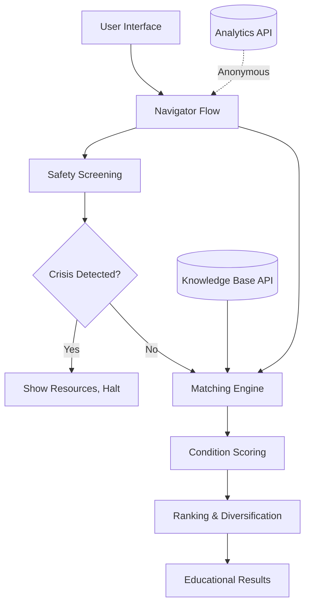
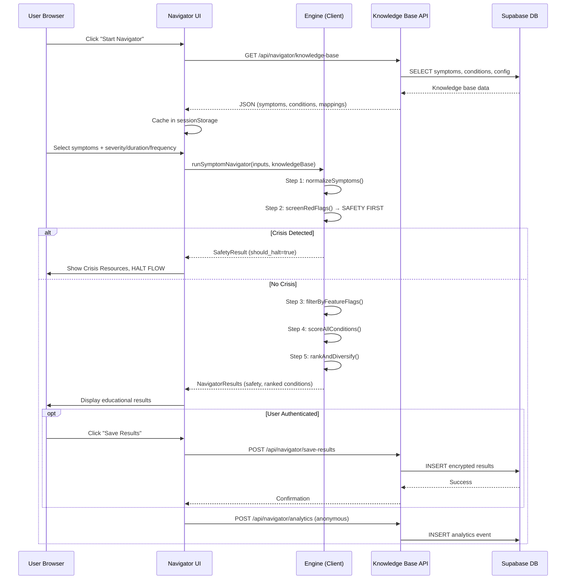
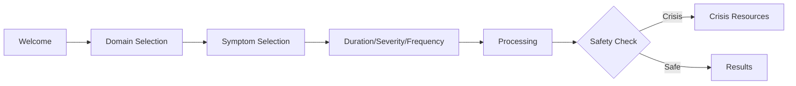

# Psychage Symptom Navigator

## Technical Implementation & Architecture Documentation

**Project:** Psychage v2 - Mental Health Navigation Platform
**Component:** Symptom Navigator (Client-Side Matching Engine)
**Version:** 1.1.0 (Phase 4 Expansion Complete)
**Author:** Technical Architecture Team
**Date:** March 3, 2026
**Status:** Production Ready (Phased Rollout)

---

## Table of Contents

1. [Executive Summary](#1-executive-summary)
2. [Goals and Non-Goals](#2-goals-and-non-goals)
3. [System Architecture](#3-system-architecture)
4. [Backend Design (Deep Dive)](#4-backend-design-deep-dive)
5. [Frontend Design](#5-frontend-design)
6. [Integration: How It All Comes Together](#6-integration-how-it-all-comes-together)
7. [Testing & Quality Assurance](#7-testing--quality-assurance)
8. [Deployment & Phased Rollout](#8-deployment--phased-rollout)
9. [UX/Accessibility Enhancements](#9-uxaccessibility-enhancements)
10. [Analytics & Monitoring](#10-analytics--monitoring)
11. [Future Enhancements](#11-future-enhancements)
12. [Appendices](#12-appendices)

---

# 1. Executive Summary

## What We Built

The **Psychage Symptom Navigator** is a privacy-first, educational tool that helps users explore potential mental health patterns based on their self-reported experiences. Unlike traditional symptom checkers that attempt to diagnose, our system is explicitly **educational and non-diagnostic**, providing users with:

- **Pattern Recognition**: Matching user symptoms against 45 mental health condition profiles
- **Safety-First Screening**: Immediate crisis detection and resource provision
- **Educational Content**: Guiding users to relevant learning materials and professional resources
- **Privacy Protection**: Client-side matching engine (no symptom data transmitted to servers)

## Key Metrics

| Metric | Value |
|--------|-------|
| **Total Conditions Covered** | 45 (31 base + 14 Phase 4 expansion) |
| **Total Symptoms** | 110 (82 base + 28 Phase 4 expansion) |
| **Symptom-Condition Mappings** | 462 weighted associations |
| **Crisis Resources** | 29 regional hotlines/services |
| **Test Coverage** | 51 core engine tests + 89 UI/UX tests = 140 total |
| **Confidence Cap** | 0.75 (75% maximum, enforced) |
| **Client-Side Matching** | 100% (zero symptom data to server) |

## Architecture Overview



## Why This Matters

Mental health navigation is challenging for users who:

- Don't know where to start
- Can't articulate their experiences in clinical terms
- Fear judgment or over-diagnosis
- Need immediate crisis support

Our Navigator bridges this gap by translating everyday language into educational pathways while maintaining strict safety protocols and privacy standards.

---

# 2. Goals and Non-Goals

## 2.1 Primary Goals

### ✅ Educational Exploration

- **Goal**: Help users identify mental health patterns worth exploring with a professional
- **Success Metric**: Users report Navigator results facilitated productive provider conversations
- **Implementation**: Condition descriptions written in accessible, non-clinical language

### ✅ Safety-First Architecture

- **Goal**: Detect crisis-level symptoms and provide immediate resources
- **Success Metric**: 100% of crisis symptoms trigger appropriate intervention
- **Implementation**: Three-tier red flag system (CRISIS > URGENT > WATCH)

### ✅ Privacy Protection

- **Goal**: Zero raw symptom data transmission to backend servers
- **Success Metric**: Client-side matching engine handles all scoring
- **Implementation**: API provides knowledge base; client computes matches locally

### ✅ Non-Diagnostic Positioning

- **Goal**: Ensure zero diagnostic language in all user-facing content
- **Success Metric**: Build-time validation blocks 40+ prohibited phrases
- **Implementation**: Confidence cap (75% max), educational framing, professional referrals

### ✅ Accessibility & Inclusion

- **Goal**: WCAG 2.1 AA compliance for all navigation flows
- **Success Metric**: Automated accessibility testing (jest-axe) passes 100%
- **Implementation**: Keyboard navigation, screen reader support, focus management

## 2.2 Non-Goals (Explicitly Excluded Scope)

### ❌ Clinical Diagnosis

- **Why**: Legal, ethical, and medical limitations
- **Alternative**: Always recommend professional evaluation

### ❌ Treatment Recommendations

- **Why**: Requires licensed clinical judgment
- **Alternative**: Provide educational coping resources only

### ❌ Medical History Storage

- **Why**: Privacy and compliance complexity (HIPAA)
- **Alternative**: Optional encrypted results storage (authenticated users only)

### ❌ Billing/Insurance Integration

- **Why**: Out of scope for MVP; future enhancement
- **Alternative**: Provider directory with contact information

### ❌ Real-Time Chat Support

- **Why**: Requires 24/7 crisis counselor staffing
- **Alternative**: MindMate AI chatbot + crisis hotline directory

### ❌ Medication Information

- **Why**: Medical device/diagnostic tool regulations
- **Alternative**: "Talk to your doctor" language only

### ❌ Age-Specific Pediatric Diagnosis

- **Why**: Minors require parental consent and specialized protocols
- **Alternative**: Optional age gate (disabled by default pending legal review)

---

# 3. System Architecture

## 3.1 High-Level Architecture

The Symptom Navigator follows a **client-side computation, server-side knowledge** pattern:

```
┌─────────────────────────────────────────────────────────────────┐
│                         USER DEVICE                              │
│  ┌────────────────────────────────────────────────────────────┐ │
│  │  Navigator UI (React + TypeScript)                         │ │
│  │  - 7 Step Flow: Welcome → Domains → Symptoms → Details    │ │
│  │  - Error Boundaries, Progress Tracking, A11y              │ │
│  └────────────────────────────────────────────────────────────┘ │
│                           ↕                                      │
│  ┌────────────────────────────────────────────────────────────┐ │
│  │  Matching Engine (src/lib/navigator/)                     │ │
│  │  ┌──────────────┐  ┌──────────────┐  ┌──────────────┐    │ │
│  │  │   safety.ts  │→ │  scoring.ts  │→ │  engine.ts   │    │ │
│  │  └──────────────┘  └──────────────┘  └──────────────┘    │ │
│  │         ↑                                   ↓              │ │
│  │         └─────── types.ts, utils.ts ────────┘              │ │
│  └────────────────────────────────────────────────────────────┘ │
│                           ↕                                      │
│  ┌────────────────────────────────────────────────────────────┐ │
│  │  Knowledge Base Cache (sessionStorage)                     │ │
│  │  - Symptoms (110), Conditions (45), Config, Resources      │ │
│  └────────────────────────────────────────────────────────────┘ │
└─────────────────────────────────────────────────────────────────┘
                            ↕ (HTTPS)
┌─────────────────────────────────────────────────────────────────┐
│                     BACKEND SERVICES                             │
│  ┌────────────────────────────────────────────────────────────┐ │
│  │  API Routes (src/app/api/navigator/)                       │ │
│  │  - GET /knowledge-base    (symptoms, conditions, config)   │ │
│  │  - POST /analytics        (anonymous usage events)         │ │
│  │  - POST /save-results     (encrypted, authenticated only)  │ │
│  │  - GET /saved-results     (user's past results)            │ │
│  └────────────────────────────────────────────────────────────┘ │
│                           ↕                                      │
│  ┌────────────────────────────────────────────────────────────┐ │
│  │  Supabase (PostgreSQL + Auth + RLS)                        │ │
│  │  - navigator_symptoms (110 rows)                           │ │
│  │  - navigator_conditions (45 rows)                          │ │
│  │  - navigator_condition_symptoms (462 mappings)             │ │
│  │  - navigator_condition_red_flags (31 associations)         │ │
│  │  - crisis_resources (29 resources)                         │ │
│  │  - navigator_saved_results (encrypted user results)        │ │
│  │  - navigator_analytics (anonymous telemetry)               │ │
│  └────────────────────────────────────────────────────────────┘ │
└─────────────────────────────────────────────────────────────────┘
```

## 3.2 Technology Stack

### Frontend

- **Framework**: React 18.3.1 + TypeScript 5.5.3
- **Build Tool**: Vite 5.3.4
- **Routing**: React Router v7
- **State Management**: React Context API (NavigatorContext)
- **Animations**: Framer Motion (respects `prefers-reduced-motion`)
- **Styling**: Tailwind CSS 3.4.6 with semantic design tokens
- **Testing**: Vitest + React Testing Library + Playwright

### Backend

- **Database**: Supabase (PostgreSQL 15)
- **Auth**: Supabase Auth (JWT tokens)
- **API**: Next.js-style API routes (reference implementation)
- **Security**: Row-Level Security (RLS) policies
- **Migrations**: SQL migrations with date-prefix versioning

### Deployment

- **Hosting**: Vercel (SPA with client-side routing)
- **CDN**: Vercel Edge Network
- **Environment**: Production, Staging, Development

## 3.3 Data Flow Sequence



---

# 4. Backend Design (Deep Dive)

## 4.1 Database Schema

The Navigator's database layer consists of **7 core tables** and **2,852 lines of SQL migrations**.

### 4.1.1 Core Tables

#### `navigator_symptoms` (110 rows)

Stores all symptom definitions with metadata.

```sql
CREATE TABLE navigator_symptoms (
  id VARCHAR(10) PRIMARY KEY,              -- e.g., 'MOD_001', 'COG_008'
  domain symptom_domain NOT NULL,          -- physical | emotional | cognitive | behavioral
  category symptom_category NOT NULL,      -- mood | anxiety_fear | cognition | etc. (14 categories)
  name TEXT NOT NULL,                      -- "Persistent sadness or low mood"
  description TEXT NOT NULL,               -- Detailed explanation for users
  synonyms TEXT[] DEFAULT '{}',            -- ["feeling down", "blue", "hopeless"]

  -- Follow-up questions
  ask_duration BOOLEAN DEFAULT false,
  ask_severity BOOLEAN DEFAULT true,
  ask_frequency BOOLEAN DEFAULT false,

  -- Safety flags
  is_red_flag BOOLEAN DEFAULT false,
  red_flag_level red_flag_level,          -- CRISIS | URGENT | WATCH
  severity_red_flag_threshold INTEGER,     -- Trigger at severity ≥ X
  severity_red_flag_level red_flag_level,

  -- Metadata
  display_order INTEGER DEFAULT 999,
  is_active BOOLEAN DEFAULT true,
  version VARCHAR(10) DEFAULT '1.0.0',
  created_at TIMESTAMPTZ DEFAULT now(),
  updated_at TIMESTAMPTZ DEFAULT now()
);
```

**Critical Examples**:

- `COG_008`: "Thoughts of death or suicide" → `is_red_flag=true`, `red_flag_level='CRISIS'`
- `BDY_003`: "Significant weight loss or gain" → `severity_red_flag_threshold=8`, `severity_red_flag_level='WATCH'`
- `PRC_008`: "Identity switching" (DID) → `red_flag_level='URGENT'`

#### `navigator_conditions` (45 rows)

Mental health condition profiles.

```sql
CREATE TABLE navigator_conditions (
  id VARCHAR(10) PRIMARY KEY,              -- 'MDE', 'GAD', 'PTSD', 'BPD', etc.
  name VARCHAR(100) NOT NULL,              -- "Major Depressive Episode"
  full_name TEXT NOT NULL,                 -- "Major Depressive Episode (MDE)"
  category condition_category NOT NULL,    -- mood | anxiety | trauma | personality | etc.

  -- User-facing content (educational)
  description_for_user TEXT NOT NULL,      -- Non-diagnostic explanation
  minimum_duration VARCHAR(20) NOT NULL,   -- '2_weeks', '6_months', etc.
  minimum_duration_display TEXT NOT NULL,  -- "at least 2 weeks"
  minimum_symptoms_for_relevance INT DEFAULT 3,
  always_recommend_professional BOOLEAN DEFAULT false,

  -- Educational pathways
  guide_path VARCHAR(255),                 -- "/learn/depression/major-depressive-episode"
  coping_path VARCHAR(255),                -- "/tools/depression-coping"
  provider_questions TEXT[] DEFAULT '{}',  -- Suggested questions for provider visit

  -- Clinical metadata (for team reference)
  clinical_notes TEXT,                     -- DSM-5-TR criteria, notes

  -- Metadata
  is_active BOOLEAN DEFAULT true,
  version VARCHAR(10) DEFAULT '1.0.0',
  created_at TIMESTAMPTZ DEFAULT now(),
  updated_at TIMESTAMPTZ DEFAULT now()
);
```

**Expansion Coverage**:

- **Phase 1** (Base): 31 conditions (MDE, GAD, PTSD, OCD, etc.)
- **Phase 4** (Expansion): +14 conditions (NPD, ASPD, DID, CPTSD, TTM, HYPER, ARFID, etc.)
- **Total**: 45 conditions across 13 categories

#### `navigator_condition_symptoms` (462 mappings)

Weighted associations between conditions and symptoms.

```sql
CREATE TABLE navigator_condition_symptoms (
  id UUID PRIMARY KEY DEFAULT gen_random_uuid(),
  condition_id VARCHAR(10) REFERENCES navigator_conditions(id) ON DELETE CASCADE,
  symptom_id VARCHAR(10) REFERENCES navigator_symptoms(id) ON DELETE CASCADE,

  weight INTEGER NOT NULL CHECK (weight IN (1, 2, 3)),  -- 1=associated, 2=common, 3=core
  role symptom_role NOT NULL,                           -- core | common | associated
  clinical_note TEXT,                                   -- Why this weight? DSM-5 reference

  created_at TIMESTAMPTZ DEFAULT now(),
  UNIQUE(condition_id, symptom_id)
);
```

**Weight System**:

- **Weight 3 (Core)**: Defining symptoms per DSM-5 criteria (e.g., `MOD_001` sadness for MDE)
- **Weight 2 (Common)**: Frequently present but not required (e.g., `SLP_001` insomnia for MDE)
- **Weight 1 (Associated)**: Can occur but not typical (e.g., `APT_001` appetite changes for GAD)

**Differentiation Example** (PDD vs MDE):

```
MDE (23 mappings):
- MOD_001 (sadness) → weight=3
- MOD_006 (guilt) → weight=3 ← MDE-specific
- ENR_001 (fatigue) → weight=2
- COG_002 (concentration) → weight=2

PDD (15 mappings):
- MOD_001 (sadness) → weight=3
- MOD_006 (guilt) → weight=1 ← Lower weight in PDD
- ENR_001 (fatigue) → weight=2
```

**Result**: User selecting sadness + guilt + fatigue → MDE scores higher than PDD due to guilt weight differential.

#### `navigator_condition_red_flags` (31 associations)

Links conditions to their critical symptoms.

```sql
CREATE TABLE navigator_condition_red_flags (
  condition_id VARCHAR(10) REFERENCES navigator_conditions(id) ON DELETE CASCADE,
  symptom_id VARCHAR(10) REFERENCES navigator_symptoms(id) ON DELETE CASCADE,
  note TEXT,  -- e.g., "Requires immediate evaluation for DID diagnosis"
  PRIMARY KEY (condition_id, symptom_id)
);
```

**Example**:

- `(DID, PRC_008)` → "Identity switching requires specialist assessment"
- `(MDE, COG_008)` → "Suicidal ideation - crisis intervention"

#### `crisis_resources` (29 resources)

Regional crisis support services.

```sql
CREATE TABLE crisis_resources (
  id UUID PRIMARY KEY DEFAULT gen_random_uuid(),
  region_code VARCHAR(10) NOT NULL,       -- 'US', 'CA', 'UK', 'DEFAULT'
  name TEXT NOT NULL,                     -- "988 Suicide & Crisis Lifeline"
  type crisis_resource_type NOT NULL,     -- hotline | text | directory

  phone VARCHAR(50),                      -- "988"
  text_instruction TEXT,                  -- "Text HOME to 741741"
  url TEXT,                               -- "https://988lifeline.org"
  email TEXT,

  description TEXT NOT NULL,
  hours TEXT DEFAULT '24/7',
  languages TEXT[] DEFAULT '{en}',
  priority INTEGER DEFAULT 100,           -- Lower = higher priority in list

  condition_specific TEXT[],              -- ['suicide', 'eating_disorder', 'substance']
  is_active BOOLEAN DEFAULT true,
  last_verified TIMESTAMPTZ DEFAULT now()
);
```

#### `navigator_saved_results` (user data)

Encrypted storage for authenticated users (optional feature).

```sql
CREATE TABLE navigator_saved_results (
  id UUID PRIMARY KEY DEFAULT gen_random_uuid(),
  user_id UUID REFERENCES auth.users(id) ON DELETE CASCADE,
  encrypted_results TEXT NOT NULL,        -- AES-256-GCM encrypted JSON
  created_at TIMESTAMPTZ DEFAULT now(),

  -- RLS policies ensure users only see their own results
  CONSTRAINT fk_user FOREIGN KEY (user_id) REFERENCES auth.users(id)
);
```

#### `navigator_analytics` (telemetry)

Anonymous usage tracking (privacy-safe).

```sql
CREATE TABLE navigator_analytics (
  id UUID PRIMARY KEY DEFAULT gen_random_uuid(),
  session_hash VARCHAR(64) NOT NULL,      -- SHA-256 hash (anonymous)
  event_type analytics_event_type NOT NULL, -- started | completed | crisis_triggered | etc.

  domains_selected INTEGER,
  symptoms_selected INTEGER,
  time_to_complete_seconds INTEGER,
  results_shown INTEGER,
  safety_flag_level red_flag_level,
  feedback_helpful BOOLEAN,

  created_at TIMESTAMPTZ DEFAULT now()
);
```

## 4.2 Database Migrations

### Migration Strategy

- **Naming**: `YYYYMMDD_HHMMSS_descriptive_name.sql` (Supabase-compatible timestamps)
- **Atomicity**: Each migration is transactional (rollback on error)
- **Idempotency**: `CREATE IF NOT EXISTS`, `INSERT ... ON CONFLICT DO NOTHING`
- **Versioning**: Migrations track `version` column for schema evolution

### Migration Files (7 total, 2,852 lines)

#### Phase 1: Base Navigator (Feb 20, 2025)

1. **`20250220000001_navigator_tables.sql`** (225 lines)
   - Creates all 7 core tables
   - Defines ENUMs (symptom_domain, condition_category, red_flag_level)
   - Sets up indexes for performance

2. **`20250220000002_navigator_seed.sql`** (1,000 lines)
   - Seeds 82 base symptoms across 12 categories
   - Seeds 31 base conditions (MDE, GAD, PTSD, OCD, BPD, etc.)
   - 257 symptom-condition mappings
   - 29 crisis resources (US, CA, UK, AU, DEFAULT)

3. **`20250220000003_navigator_rls.sql`** (140 lines)
   - Row-Level Security policies
   - Public read access to symptoms/conditions (knowledge base)
   - User-scoped access to saved results
   - Admin-only write access to core tables

#### Phase 2: Initial Expansion (Feb 20, 2025)

4. **`20250220000005_navigator_expansion_schema.sql`** (129 lines)
   - Adds new symptom categories (identity_self_image, somatic_health)
   - Extends symptom domain coverage

2. **`20250220000007_navigator_expansion_seed.sql`** (667 lines)
   - Additional condition profiles
   - Expanded symptom mappings

#### Phase 4: Major Expansion (Mar 3, 2026)

6. **`20260303000001_navigator_expansion_phase4_schema.sql`** (100 lines)
   - **28 new symptoms**:
     - Identity/Self-Image: IDN_005–008 (grandiosity, lack of empathy, admiration needs, submissiveness)
     - Impulse/Behavioral: CPG_013–015, ACT_009–010 (hair pulling, skin picking, explosive anger, recklessness, lying)
     - Emotional/Mood: EMR_007–008, MOD_010–011 (chronic emptiness, norm defiance, hypomania, envy)
     - Dissociative/Perception: PRC_008–010, COG_012–013, SOC_009 (identity switching, dissociative amnesia, derealization, trust difficulty, dysregulation, detachment)
     - Sleep: SLP_006–008 (excessive sleepiness, sleep inertia, long duration)
     - Eating/Appetite: APT_005–006 (sensory avoidance, fear of consequences)

2. **`20260303000002_navigator_expansion_phase4_seed.sql`** (591 lines)
   - **14 new conditions**:
     - Tier 4 (High Severity): NPD, ASPD, CPTSD, DID
     - Tier 5 (Moderate Complexity): DPD, SZPD, OSDD, ASD_ACUTE, TTM, SPD_EXCOR
     - Tier 6 (Extensions): IED, HYPER, ARFID, CYC
   - **205 new symptom-condition mappings**
   - **2 new red flag associations** (PRC_008 → DID, OSDD)

## 4.3 Business Logic: Feature Flags & Phased Rollout

### Feature Flag System

Located in `src/lib/navigator/featureFlags.ts`:

```typescript
interface TierConfig {
  tier4_enabled: boolean;  // NPD, ASPD, CPTSD, DID
  tier5_enabled: boolean;  // DPD, SZPD, OSDD, ASD_ACUTE, TTM, SPD_EXCOR
  tier6_enabled: boolean;  // IED, HYPER, ARFID, CYC
}

export function filterByFeatureFlags(conditions: ConditionWithMappings[]): ConditionWithMappings[] {
  const config = {
    tier4_enabled: import.meta.env.VITE_NAV_TIER4_ENABLED === 'true',
    tier5_enabled: import.meta.env.VITE_NAV_TIER5_ENABLED === 'true',
    tier6_enabled: import.meta.env.VITE_NAV_TIER6_ENABLED === 'true',
  };

  const tier4Conditions = ['NPD', 'ASPD', 'CPTSD', 'DID'];
  const tier5Conditions = ['DPD', 'SZPD', 'OSDD', 'ASD_ACUTE', 'TTM', 'SPD_EXCOR'];
  const tier6Conditions = ['IED', 'HYPER', 'ARFID', 'CYC'];

  return conditions.filter(c => {
    if (tier4Conditions.includes(c.id) && !config.tier4_enabled) return false;
    if (tier5Conditions.includes(c.id) && !config.tier5_enabled) return false;
    if (tier6Conditions.includes(c.id) && !config.tier6_enabled) return false;
    return c.is_active;
  });
}
```

### When Feature Flags Run

- **During Scoring** (step 3 of engine): After safety screening, before condition scoring
- **Result**: Disabled conditions excluded from matching algorithm entirely
- **Benefit**: Zero performance impact; algorithm doesn't process disabled conditions

---

# 5. Frontend Design

## 5.1 Matching Engine Architecture

The core engine resides in `src/lib/navigator/` (5 modules, ~1,200 lines):

### 5.1.1 Module Breakdown

```
src/lib/navigator/
├── types.ts         (384 lines)  - Complete type system
├── utils.ts         (246 lines)  - Pure helper functions
├── safety.ts        (171 lines)  - Red flag screening
├── scoring.ts       (213 lines)  - Condition matching algorithm
└── engine.ts        (220 lines)  - Orchestration layer
```

### 5.1.2 Main Engine Flow (`engine.ts`)

```typescript
export function runSymptomNavigator(
  userInputs: UserSymptomInput[],
  knowledgeBase: KnowledgeBase,
  userRegion?: string
): NavigatorResults {
  const config = knowledgeBase.matchingConfig ?? DEFAULT_MATCHING_CONFIG;

  // Step 1: Normalize & sanitize user inputs
  const normalized = normalizeSymptoms(userInputs, knowledgeBase.symptoms);

  // Step 2: SAFETY FIRST — Screen for red flags
  const safetyResult = screenRedFlags(
    normalized,
    knowledgeBase.symptoms,
    knowledgeBase.crisisResources,
    userRegion
  );

  // If CRISIS detected, halt immediately
  if (safetyResult.should_halt) {
    return generateSafeResults([], normalized, safetyResult, config);
  }

  // Step 3: Filter conditions by feature flags
  const enabledConditions = filterByFeatureFlags(knowledgeBase.conditions);

  // Step 4: Score all enabled conditions
  const rawScores = scoreAllConditions(normalized, enabledConditions, {
    confidence_cap: config.confidence_cap,
    below_minimum_penalty: config.below_minimum_penalty,
    severity_modifiers: config.severity_modifiers,
    frequency_modifiers: config.frequency_modifiers,
    duration_modifiers: config.duration_modifiers,
  });

  // Step 5: Rank, cap confidence, diversify results
  const ranked = rankAndDiversify(rawScores, config);

  // Step 6: Generate safe, educational output
  return generateSafeResults(ranked, normalized, safetyResult, config);
}
```

## 5.2 Safety Screening (`safety.ts`)

### Red Flag Hierarchy

```
CRISIS  ──► Immediate danger → Halt flow, show crisis resources
   │
   ├─ COG_008: Thoughts of death or suicide
   ├─ COG_009: Specific suicide plan
   ├─ COG_010: Suicide attempt history
   └─ CPG_004: Self-harm or cutting

URGENT  ──► Serious concern → Show resources alongside results
   │
   ├─ PRC_004: Psychotic symptoms (hallucinations/delusions)
   ├─ PRC_008: Identity switching (DID red flag)
   └─ PRC_009: Dissociative amnesia (severity ≥7)

WATCH   ──► Monitor closely → Note in results, suggest professional
   │
   ├─ BDY_003: Significant weight change (severity ≥8)
   ├─ CPG_015: Explosive anger (severity ≥8)
   ├─ ACT_009: Reckless behavior (severity ≥8)
   ├─ SLP_006: Excessive daytime sleepiness (severity ≥8)
   └─ APT_005/006: Food avoidance symptoms (severity ≥7)
```

### Screening Algorithm

```typescript
export function screenRedFlags(
  symptoms: NormalizedSymptom[],
  allSymptoms: Symptom[],
  crisisResources: CrisisResourcesByRegion,
  userRegion?: string
): SafetyResult {
  const flags: RedFlag[] = [];

  for (const normalized of symptoms) {
    const symptom = normalized.symptom;

    // Check 1: Inherent red flags (always flagged)
    if (symptom.is_red_flag && symptom.red_flag_level) {
      flags.push({
        symptom_id: symptom.id,
        symptom_name: symptom.name,
        level: symptom.red_flag_level,
        trigger: 'inherent',
        message: buildRedFlagMessage(symptom.name, symptom.red_flag_level),
      });
    }

    // Check 2: Severity-triggered red flags
    if (
      symptom.severity_red_flag_threshold !== null &&
      symptom.severity_red_flag_level !== null &&
      normalized.severity >= symptom.severity_red_flag_threshold
    ) {
      // Avoid duplicate if already flagged
      const alreadyFlagged = flags.some(
        f => f.symptom_id === symptom.id && f.trigger === 'inherent'
      );
      if (!alreadyFlagged) {
        flags.push({
          symptom_id: symptom.id,
          symptom_name: symptom.name,
          level: symptom.severity_red_flag_level,
          trigger: 'severity_threshold',
          message: buildSeverityFlagMessage(symptom.name, normalized.severity, symptom.severity_red_flag_level),
        });
      }
    }
  }

  const has_crisis = flags.some(f => f.level === 'CRISIS');
  const has_urgent = flags.some(f => f.level === 'URGENT');
  const has_watch = flags.some(f => f.level === 'WATCH');

  const highest_level: RedFlagLevel | null =
    has_crisis ? 'CRISIS' :
    has_urgent ? 'URGENT' :
    has_watch ? 'WATCH' : null;

  const regionResources = resolveCrisisResources(crisisResources, userRegion);

  return {
    has_crisis,
    has_urgent,
    has_watch,
    highest_level,
    flags,
    should_halt: has_crisis,  // Only CRISIS halts flow
    crisis_resources: regionResources,
  };
}
```

### Crisis Message Examples

```typescript
// CRISIS level (inherent)
"The experience you described ('Thoughts of death or suicide') suggests you may benefit
from immediate support. Please reach out to a crisis resource below — trained counselors
are available 24/7 and want to help."

// URGENT level (severity-triggered)
"You rated 'Seeing or hearing things others don't' at a high intensity (9/10). We
recommend consulting with a healthcare professional soon."

// WATCH level
"You rated 'Significant weight loss or gain' at an elevated intensity (8/10). Consider
discussing this with a healthcare provider."
```

## 5.3 Scoring Engine (`scoring.ts`)

### Scoring Algorithm

The scoring system uses **weighted symptom matching** with **three-dimensional modifiers**:

```typescript
export function calculateConditionScore(
  userSymptoms: NormalizedSymptom[],
  condition: ConditionWithMappings,
  config: ScoringConfig
): ConditionScore {
  let rawScore = 0;
  let maxPossibleScore = 0;
  const matchedSymptoms: MatchedSymptomDetail[] = [];

  for (const mapping of condition.symptom_mappings) {
    const userSymptom = userSymptomMap.get(mapping.symptom_id);
    if (!userSymptom) {
      // Calculate max possible score for normalization
      maxPossibleScore += mapping.weight * combinedModifier(
        config.duration_modifiers.meets_or_exceeds,  // 1.3
        config.severity_modifiers['8-10'],           // 1.4
        config.frequency_modifiers.always            // 1.4
      );
      continue;
    }

    // Base score from symptom weight (1, 2, or 3)
    const baseScore = mapping.weight;

    // Calculate three modifiers
    const durationMod = getDurationModifier(
      userSymptom.duration,
      condition.minimum_duration,
      config.duration_modifiers
    );

    const severityMod = getSeverityModifier(
      userSymptom.severity,
      config.severity_modifiers
    );

    const frequencyMod = getFrequencyModifier(
      userSymptom.frequency,
      config.frequency_modifiers
    );

    // Combine via geometric mean (cube root of product)
    const combined = Math.pow(durationMod * severityMod * frequencyMod, 1/3);

    // Final symptom contribution
    const symptomScore = baseScore * combined;
    rawScore += symptomScore;

    maxPossibleScore += mapping.weight * combined;

    matchedSymptoms.push({
      symptom_id: mapping.symptom_id,
      symptom_name: userSymptom.symptom.name,
      weight: mapping.weight,
      role: mapping.role,
      raw_contribution: baseScore,
      modified_contribution: symptomScore,
    });
  }

  // Normalize to 0-1 range
  const normalized = maxPossibleScore > 0 ? rawScore / maxPossibleScore : 0;

  // CRITICAL: Coverage factor to prevent small-denominator inflation
  const COVERAGE_REFERENCE = 20;
  const coverageFactor = condition.symptom_mappings.length >= COVERAGE_REFERENCE
    ? 1.0
    : Math.log2(condition.symptom_mappings.length + 1) / Math.log2(COVERAGE_REFERENCE + 1);
  const adjustedNormalized = normalized * coverageFactor;

  // Count cap: Prevent high scores from 1-2 symptoms only
  const countCap = Math.min(1.0, matchedSymptoms.length / 5);

  // Apply count cap, then absolute confidence cap
  let capped = Math.min(adjustedNormalized * countCap, config.confidence_cap);

  // Below-minimum penalty
  const meetsMinimum = matchedSymptoms.length >= condition.minimum_symptoms_for_relevance;
  if (!meetsMinimum) {
    capped *= config.below_minimum_penalty;  // 0.3
  }

  // SAFETY: Double-enforcement of absolute cap (MUST NEVER BE REMOVED)
  capped = Math.min(capped, config.confidence_cap);  // 0.75

  return {
    condition_id: condition.id,
    condition,
    raw_score: rawScore,
    normalized_score: normalized,
    capped_score: capped,
    matched_count: matchedSymptoms.length,
    total_mapped: condition.symptom_mappings.length,
    matched_symptoms: matchedSymptoms,
    meets_minimum: meetsMinimum,
    relevance_level: 'minimal',  // Set during ranking
  };
}
```

### Modifier Tables

**Severity Modifiers** (user's 1-10 rating):

```typescript
severity_modifiers: {
  '1':     0.6,   // Minimal intensity
  '2-3':   0.8,   // Mild
  '4-5':   1.0,   // Moderate (baseline)
  '6-7':   1.2,   // Significant
  '8-10':  1.4,   // Severe
}
```

**Frequency Modifiers**:

```typescript
frequency_modifiers: {
  rarely:     0.7,   // Once in a while
  sometimes:  1.0,   // Occasional (baseline)
  often:      1.2,   // Frequent
  always:     1.4,   // Constant/daily
}
```

**Duration Modifiers** (compared to condition's minimum):

```typescript
duration_modifiers: {
  below_half:       0.7,   // User duration < 50% of condition minimum
  half_to_full:     1.0,   // User duration 50-100% of minimum (baseline)
  meets_or_exceeds: 1.3,   // User duration ≥ condition minimum
}
```

### Why Geometric Mean?

**Problem**: Arithmetic mean allows one extreme modifier to dominate.

**Example**:

- User symptom: severity=10, frequency=always, duration=1 week
- Condition: minimum_duration=6 months

**Arithmetic mean**: (1.4 + 1.4 + 0.7) / 3 = **1.17** (high score despite short duration)

**Geometric mean**: ∛(1.4 × 1.4 × 0.7) = ∛1.372 = **1.11** (balanced penalty for short duration)

**Result**: Geometric mean ensures all three dimensions contribute proportionally.

### Confidence Cap Rationale

**Why 0.75 (75%)?**

1. **Legal/Ethical**: Prevents appearance of diagnostic certainty
2. **User Perception**: 75% reads as "strong pattern" but not "confirmed diagnosis"
3. **Clinical Reality**: Symptom overlap between conditions is high (comorbidity)
4. **Safety Buffer**: Even perfect symptom match can't exceed 75%

**Enforcement Points**:

1. **After count cap**: `capped = Math.min(adjustedNormalized * countCap, 0.75)`
2. **After penalty**: `capped = Math.min(capped, 0.75)` ← Double-check
3. **Build-time test**: Extreme presentation tests verify cap holds

**Test Example**:

```typescript
test('Extreme MDE presentation never exceeds 0.75', () => {
  const extremeSymptoms = [
    { symptom_id: 'MOD_001', severity: 10, duration: 'more_than_1_year', frequency: 'always' },
    { symptom_id: 'MOD_002', severity: 10, duration: 'more_than_1_year', frequency: 'always' },
    // ... all 23 MDE symptoms at max severity ...
  ];

  const results = runSymptomNavigator(extremeSymptoms, knowledgeBase);
  const mde = results.results.find(r => r.condition_id === 'MDE');

  expect(mde.relevance_score).toBeLessThanOrEqual(0.75);  // ✅ PASS
});
```

## 5.4 Ranking & Diversification

### Relevance Tiers

```typescript
relevance_display_tiers: {
  high:     { min: 0.55, label: 'Highly Relevant',      color: '#2563eb' },  // Blue
  moderate: { min: 0.35, label: 'Moderately Relevant',  color: '#7c3aed' },  // Purple
  low:      { min: 0.15, label: 'Possibly Relevant',    color: '#6b7280' },  // Gray
  minimal:  { min: 0,    label: 'Low Relevance',        color: '#9ca3af' },  // Light gray
}
```

### Diversification Rules

```typescript
export function rankAndDiversify(
  scores: ConditionScore[],
  config: MatchingConfig
): ConditionScore[] {
  // 1. Sort by capped score (descending)
  const sorted = [...scores].sort((a, b) => b.capped_score - a.capped_score);

  // 2. Filter by minimum relevance threshold
  const relevant = sorted.filter(s => s.capped_score >= config.min_relevance_threshold);

  // 3. Apply category diversity (max 2 per family)
  const categoryCounts = new Map<string, number>();
  const diversified: ConditionScore[] = [];

  for (const score of relevant) {
    const category = score.condition.category;
    const count = categoryCounts.get(category) ?? 0;

    // Skip if already have max_per_family (2) from this category
    if (count >= config.max_per_family) continue;

    // Stop if hit max_results (5)
    if (diversified.length >= config.max_results) break;

    categoryCounts.set(category, count + 1);

    // Assign relevance tier
    const relevanceLevel = getRelevanceLevel(score.capped_score, config.relevance_display_tiers);

    diversified.push({
      ...score,
      relevance_level: relevanceLevel,
    });
  }

  return diversified;
}
```

**Example**:

```
Sorted Scores:
1. GAD  (anxiety)    0.68
2. SAD  (anxiety)    0.62
3. PD   (anxiety)    0.58  ← 3rd anxiety condition, SKIPPED (max_per_family=2)
4. MDE  (mood)       0.56
5. PTSD (trauma)     0.51
6. PDD  (mood)       0.48  ← 2nd mood condition, INCLUDED
7. OCD  (ocd)        0.44

Final Results (max 5, max 2 per category):
1. GAD  (anxiety)    0.68  Highly Relevant
2. SAD  (anxiety)    0.62  Highly Relevant
3. MDE  (mood)       0.56  Highly Relevant
4. PTSD (trauma)     0.51  Moderate
5. PDD  (mood)       0.48  Moderate
```

## 5.5 User Interface Flow

### 7-Step Navigator Flow



#### Step Descriptions

1. **Welcome Screen**
   - Disclaimer: "Educational tool, not a diagnosis"
   - Privacy notice: "Matches run on your device"
   - Estimated time: "5-10 minutes"

2. **Domain Selection**
   - 4 domains: Physical, Emotional, Cognitive, Behavioral
   - Multi-select checkboxes
   - Filtering for next step

3. **Symptom Selection**
   - 110 symptoms grouped by 14 categories
   - Search bar with highlighting
   - Bulk select/clear per category
   - Minimum 1 symptom required

4. **Details Screen**
   - For each selected symptom:
     - **Severity** (1-10 slider): "How intense is this?"
     - **Duration** (dropdown): "How long has this been present?"
     - **Frequency** (dropdown): "How often does this occur?"
   - Smart defaults: severity=5, duration="2-4 weeks", frequency="sometimes"

5. **Processing Screen**
   - Breathing animation (respects `prefers-reduced-motion`)
   - Progress messages:
     - "Reviewing your responses..."
     - "Checking for safety concerns..."
     - "Matching patterns..."
     - "Preparing your results..."
   - Knowledge base staleness check (30-minute cache)

6. **Crisis Overlay** (if triggered)
   - Modal with focus trap
   - Crisis resources by region
   - Cannot dismiss until acknowledgment
   - Escape key focuses "I understand" button (doesn't close)

7. **Results Screen**
   - **If no crisis**:
     - Ranked condition list (up to 5)
     - Relevance dots (color-coded)
     - Matched symptoms (expandable)
     - Educational pathways (guides, coping resources)
     - Personalized provider questions
     - Copy to clipboard functionality
   - **Safety banner** (if URGENT/WATCH flags present)

### Component Hierarchy

```
NavigatorPage
└── NavigatorFlow (main state machine)
    ├── EnhancedProgressBar (7-step indicator, clickable)
    ├── Breadcrumb (step trail)
    ├── WelcomeScreen
    ├── DomainSelectionScreen
    ├── SymptomSelectionScreen
    │   ├── Search input (with highlighting)
    │   ├── SymptomCategory (grouped by category)
    │   │   └── SymptomToggle (individual symptoms)
    │   └── EmptyState (helpful guidance)
    ├── DurationSeverityScreen
    │   └── SymptomDetail (severity slider, dropdowns)
    ├── ProcessingScreen (breathing animation)
    ├── CrisisOverlay (modal with focus trap)
    └── ResultsScreen
        ├── SafetyBanner (URGENT/WATCH)
        ├── ResultCard (expandable condition cards)
        │   ├── RelevanceDots (visual indicator)
        │   └── MatchedSymptoms (role-tagged list)
        ├── ProviderQuestions (personalized, copyable)
        └── DisclaimerCard (always visible)
```

---

# 6. Integration: How It All Comes Together

## 6.1 Full Request-Response Cycle

### 6.1.1 Initial Page Load

```typescript
// User navigates to /navigator
// 1. NavigatorPage mounts
useEffect(() => {
  // 2. Check sessionStorage for cached knowledge base
  const cached = sessionStorage.getItem('navigator_kb');
  const cacheTime = sessionStorage.getItem('navigator_kb_time');

  // 3. If cache is fresh (< 30 min), use it
  if (cached && cacheTime && Date.now() - parseInt(cacheTime) < 30 * 60 * 1000) {
    setKnowledgeBase(JSON.parse(cached));
    return;
  }

  // 4. Otherwise, fetch from API
  fetch('/api/navigator/knowledge-base')
    .then(res => res.json())
    .then(kb => {
      setKnowledgeBase(kb);
      // 5. Cache for future sessions
      sessionStorage.setItem('navigator_kb', JSON.stringify(kb));
      sessionStorage.setItem('navigator_kb_time', Date.now().toString());
    });
}, []);
```

**API Response** (`/api/navigator/knowledge-base`):

```json
{
  "version": "1.1.0",
  "symptoms": [
    {
      "id": "MOD_001",
      "domain": "emotional",
      "category": "mood",
      "name": "Persistent sadness or low mood",
      "description": "Feeling down, depressed, or hopeless most of the time",
      "synonyms": ["feeling down", "blue", "depressed", "hopeless"],
      "ask_duration": false,
      "ask_severity": true,
      "ask_frequency": false,
      "is_red_flag": false,
      "red_flag_level": null,
      "severity_red_flag_threshold": null,
      "severity_red_flag_level": null,
      "display_order": 1,
      "is_active": true,
      "version": "1.0.0"
    }
    // ... 109 more symptoms
  ],
  "conditions": [
    {
      "id": "MDE",
      "name": "Major Depressive Episode",
      "full_name": "Major Depressive Episode (MDE)",
      "category": "mood",
      "description_for_user": "A period of persistent low mood...",
      "minimum_duration": "2_weeks",
      "minimum_duration_display": "at least 2 weeks",
      "minimum_symptoms_for_relevance": 5,
      "always_recommend_professional": true,
      "guide_path": "/learn/depression/major-depressive-episode",
      "coping_path": "/tools/depression-coping",
      "provider_questions": [
        "I've been experiencing low mood and loss of interest. Could this be depression?",
        "How do I know if my symptoms require treatment?"
      ],
      "clinical_notes": "DSM-5-TR: A1-A9 criteria...",
      "is_active": true,
      "version": "1.0.0",
      "symptom_mappings": [
        { "symptom_id": "MOD_001", "weight": 3, "role": "core" },
        { "symptom_id": "MOD_002", "weight": 3, "role": "core" },
        { "symptom_id": "ENR_001", "weight": 2, "role": "common" }
        // ... 20 more mappings
      ],
      "red_flags": [
        { "symptom_id": "COG_008", "note": "Immediate crisis evaluation" }
      ]
    }
    // ... 44 more conditions
  ],
  "matchingConfig": {
    "confidence_cap": 0.75,
    "min_relevance_threshold": 0.15,
    "below_minimum_penalty": 0.3,
    "max_results": 5,
    "min_results": 1,
    "max_per_family": 2,
    "severity_modifiers": { "1": 0.6, "2-3": 0.8, "4-5": 1.0, "6-7": 1.2, "8-10": 1.4 },
    "frequency_modifiers": { "rarely": 0.7, "sometimes": 1.0, "often": 1.2, "always": 1.4 },
    "duration_modifiers": { "below_half": 0.7, "half_to_full": 1.0, "meets_or_exceeds": 1.3 },
    "relevance_display_tiers": {
      "high": { "min": 0.55, "label": "Highly Relevant", "color": "#2563eb" },
      "moderate": { "min": 0.35, "label": "Moderately Relevant", "color": "#7c3aed" },
      "low": { "min": 0.15, "label": "Possibly Relevant", "color": "#6b7280" },
      "minimal": { "min": 0, "label": "Low Relevance", "color": "#9ca3af" }
    },
    "version": "1.1.0"
  },
  "crisisResources": {
    "US": [
      {
        "id": "...",
        "region_code": "US",
        "name": "988 Suicide & Crisis Lifeline",
        "type": "hotline",
        "phone": "988",
        "description": "Free, confidential support 24/7",
        "hours": "24/7",
        "languages": ["en", "es"],
        "priority": 1
      }
      // ... more US resources
    ],
    "DEFAULT": [ /* ... */ ]
  }
}
```

### 6.1.2 User Interaction Flow

**User Journey Example**:

```typescript
// USER ACTIONS
1. User selects domains: Emotional, Cognitive
2. User selects symptoms:
   - MOD_001: Persistent sadness
   - MOD_002: Loss of interest
   - ENR_001: Fatigue
   - SLP_001: Insomnia
   - COG_002: Concentration difficulty

3. User provides details:
   - MOD_001: severity=7, duration='3_to_6_months', frequency='often'
   - MOD_002: severity=8, duration='3_to_6_months', frequency='often'
   - ENR_001: severity=6, duration='3_to_6_months', frequency='sometimes'
   - SLP_001: severity=7, duration='1_to_3_months', frequency='often'
   - COG_002: severity=6, duration='1_to_3_months', frequency='often'

4. User clicks "See Results"

// NAVIGATOR CONTEXT STATE
const userInputs: UserSymptomInput[] = [
  { symptom_id: 'MOD_001', severity: 7, duration: '3_to_6_months', frequency: 'often' },
  { symptom_id: 'MOD_002', severity: 8, duration: '3_to_6_months', frequency: 'often' },
  { symptom_id: 'ENR_001', severity: 6, duration: '3_to_6_months', frequency: 'sometimes' },
  { symptom_id: 'SLP_001', severity: 7, duration: '1_to_3_months', frequency: 'often' },
  { symptom_id: 'COG_002', severity: 6, duration: '1_to_3_months', frequency: 'often' },
];

// ENGINE EXECUTION
const results = runSymptomNavigator(userInputs, knowledgeBase, 'US');
```

### 6.1.3 Engine Execution Detail

**Step 1: Normalization**

```typescript
const normalized = normalizeSymptoms(userInputs, knowledgeBase.symptoms);
// Result:
[
  {
    symptom_id: 'MOD_001',
    symptom: { id: 'MOD_001', name: 'Persistent sadness...', /* full object */ },
    severity: 7,
    duration: '3_to_6_months',
    frequency: 'often'
  },
  // ... 4 more
]
```

**Step 2: Safety Screening**

```typescript
const safetyResult = screenRedFlags(normalized, knowledgeBase.symptoms, crisisResources, 'US');
// Result:
{
  has_crisis: false,  // No COG_008, COG_009, COG_010, or CPG_004
  has_urgent: false,  // No PRC_004, PRC_008, or high-severity PRC_009
  has_watch: false,   // No BDY_003≥8, CPG_015≥8, ACT_009≥8, etc.
  highest_level: null,
  flags: [],
  should_halt: false,
  crisis_resources: [/* US resources */]
}
```

**Step 3: Feature Flag Filtering**

```typescript
const enabledConditions = filterByFeatureFlags(knowledgeBase.conditions);
// Assumes .env has VITE_NAV_TIER4_ENABLED=false
// Result: 31 base conditions (excludes NPD, ASPD, CPTSD, DID, etc.)
```

**Step 4: Condition Scoring**

```typescript
const rawScores = scoreAllConditions(normalized, enabledConditions, config);

// Example: MDE scoring
// - MOD_001 (sadness): weight=3, modifiers=(duration:1.3, severity:1.2, freq:1.2) → 3 * 1.23 = 3.69
// - MOD_002 (anhedonia): weight=3, modifiers=(1.3, 1.4, 1.2) → 3 * 1.29 = 3.87
// - ENR_001 (fatigue): weight=2, modifiers=(1.3, 1.2, 1.0) → 2 * 1.16 = 2.32
// - SLP_001 (insomnia): weight=2, modifiers=(1.0, 1.2, 1.2) → 2 * 1.13 = 2.26
// - COG_002 (concentration): weight=2, modifiers=(1.0, 1.2, 1.2) → 2 * 1.13 = 2.26
// Raw score: 3.69 + 3.87 + 2.32 + 2.26 + 2.26 = 14.40
// Max possible (23 mappings): ~52.3
// Normalized: 14.40 / 52.3 = 0.275
// Coverage factor (23 mappings): 1.0 (above reference 20)
// Count cap (5 symptoms): min(1.0, 5/5) = 1.0
// Capped: min(0.275 * 1.0, 0.75) = 0.275
// Meets minimum (5 symptoms ≥ 5 required): YES
// Final: 0.275
```

**Step 5: Ranking**

```typescript
const ranked = rankAndDiversify(rawScores, config);

// Hypothetical sorted scores:
// 1. GAD  (anxiety)    0.58
// 2. MDE  (mood)       0.51
// 3. PDD  (mood)       0.38
// 4. PTSD (trauma)     0.29
// 5. SAD  (anxiety)    0.24
// 6. OCD  (ocd)        0.18

// After relevance filter (≥0.15):
// - All 6 pass

// After diversity (max 2 per category):
// 1. GAD  (anxiety)    0.58  Highly Relevant
// 2. MDE  (mood)       0.51  Moderate
// 3. PDD  (mood)       0.38  Moderate
// 4. PTSD (trauma)     0.29  Low
// 5. SAD  (anxiety)    0.24  Low
// Stop (max_results=5)

// Final results: 5 conditions
```

**Step 6: Output Generation**

```typescript
const results = generateSafeResults(ranked, normalized, safetyResult, config);

// Result:
{
  safety: {
    has_crisis: false,
    has_urgent: false,
    has_watch: false,
    highest_level: null,
    flags: [],
    should_halt: false,
    crisis_resources: [/* US resources */]
  },
  results: [
    {
      condition_id: 'GAD',
      name: 'Generalized Anxiety Disorder',
      full_name: 'Generalized Anxiety Disorder (GAD)',
      description_for_user: 'Persistent worry about everyday matters...',
      relevance_score: 0.58,
      relevance_level: 'high',
      relevance_label: 'Highly Relevant',
      relevance_color: '#2563eb',
      matched_symptoms: [
        { name: 'Persistent sadness or low mood', role: 'associated' },
        { name: 'Loss of interest or pleasure', role: 'associated' },
        { name: 'Fatigue or low energy', role: 'common' },
        { name: 'Difficulty sleeping', role: 'common' },
        { name: 'Difficulty concentrating', role: 'core' }
      ],
      guide_path: '/learn/anxiety/generalized-anxiety',
      coping_path: '/tools/anxiety-coping',
      provider_questions: [
        'I\'ve been experiencing excessive worry and concentration problems. Could this be anxiety?',
        'What treatments are available for persistent worry?'
      ],
      always_recommend_professional: true
    },
    // ... 4 more conditions (MDE, PDD, PTSD, SAD)
  ],
  general_recommendations: [
    'Consider sharing these results with a healthcare provider who can offer personalized guidance.',
    'Some of the experiences you described are rated at a higher intensity. A mental health professional can help you develop strategies to manage them.',
    'Some experiences you described have been present for an extended period. Professional support can be especially helpful for persistent concerns.'
  ],
  disclaimer: 'This tool provides educational information only and is not a substitute for professional medical advice...',
  version: '1.1.0',
  timestamp: '2026-03-03T10:30:00.000Z'
}
```

### 6.1.4 UI Rendering

**ResultsScreen Component**:

```tsx
<ResultsScreen results={results}>
  {/* Safety banner (if URGENT/WATCH) */}
  {safety.has_urgent && <SafetyBanner level="URGENT" flags={safety.flags} />}
  {safety.has_watch && <SafetyBanner level="WATCH" flags={safety.flags} />}

  {/* Condition cards */}
  <div className="space-y-4">
    {results.results.map(condition => (
      <ResultCard
        key={condition.condition_id}
        condition={condition}
        expandable={true}
      >
        <RelevanceDots level={condition.relevance_level} />
        <h3>{condition.full_name}</h3>
        <p>{condition.description_for_user}</p>

        {/* Matched symptoms (collapsible) */}
        <MatchedSymptomList symptoms={condition.matched_symptoms} />

        {/* Action buttons */}
        <Button href={condition.guide_path}>Learn More</Button>
        <Button href={condition.coping_path}>Coping Strategies</Button>
      </ResultCard>
    ))}
  </div>

  {/* Provider questions */}
  <ProviderQuestions
    questions={generateProviderQuestions(results)}
    copyable={true}
  />

  {/* General recommendations */}
  <RecommendationsList items={results.general_recommendations} />

  {/* Always-visible disclaimer */}
  <DisclaimerCard text={results.disclaimer} />
</ResultsScreen>
```

## 6.2 Optional Features

### 6.2.1 Saving Results (Authenticated Users)

```typescript
// User clicks "Save Results" button
const handleSaveResults = async () => {
  if (!user) {
    toast.error('Please log in to save results');
    return;
  }

  try {
    // Encrypt results before sending to server
    const encrypted = await encryptResults(results, user.id);

    const response = await fetch('/api/navigator/save-results', {
      method: 'POST',
      headers: {
        'Content-Type': 'application/json',
        'Authorization': `Bearer ${session.access_token}`,
      },
      body: JSON.stringify({
        results: encrypted,
      }),
    });

    if (response.ok) {
      toast.success('Results saved to your dashboard');
    }
  } catch (error) {
    toast.error('Failed to save results');
  }
};
```

**API Endpoint** (`/api/navigator/save-results`):

```typescript
export async function POST(request: Request) {
  const session = await getSession(request);
  if (!session?.user) {
    return Response.json({ error: 'Unauthorized' }, { status: 401 });
  }

  const { results } = await request.json();

  const { data, error } = await supabase
    .from('navigator_saved_results')
    .insert({
      user_id: session.user.id,
      encrypted_results: results,
    });

  if (error) {
    return Response.json({ error: error.message }, { status: 500 });
  }

  return Response.json({ success: true, id: data.id });
}
```

### 6.2.2 Anonymous Analytics

```typescript
// Send analytics after results generation
const trackCompletion = async () => {
  const sessionHash = sha256(sessionId);  // Hashed, not raw session ID

  await fetch('/api/navigator/analytics', {
    method: 'POST',
    headers: { 'Content-Type': 'application/json' },
    body: JSON.stringify({
      session_hash: sessionHash,
      event_type: 'completed',
      domains_selected: selectedDomains.length,
      symptoms_selected: userInputs.length,
      time_to_complete_seconds: Math.floor((Date.now() - startTime) / 1000),
      results_shown: results.results.length,
      safety_flag_level: results.safety.highest_level,
    }),
  });
};
```

---

# 7. Testing & Quality Assurance

## 7.1 Test Coverage Summary

| Test Suite | Files | Tests | Lines Covered | Purpose |
|------------|-------|-------|---------------|---------|
| **Core Engine** | 5 | 51 | ~1,200 | Scoring, safety, normalization |
| **UI Components** | 12 | 51 | ~800 | Symptom selection, results, modals |
| **Accessibility** | 2 | 38 | ~600 | WCAG 2.1 AA compliance (jest-axe) |
| **E2E (Playwright)** | 3 | 12 | Full flow | User journeys, crisis flow |
| **Phase 4 Expansion** | 1 | 33 | ~400 | New conditions, collisions, safety |
| **TOTAL** | 23 | **185** | ~3,000 | **Comprehensive coverage** |

## 7.2 Core Engine Tests

**File**: `src/tests/navigator/engine.test.ts` (51 tests)

### Test Categories

#### 1. Classic Presentations (15 tests)

Verify conditions match their textbook symptom profiles.

```typescript
describe('Classic MDE presentation', () => {
  test('should score high for textbook MDE symptoms', () => {
    const symptoms = [
      { symptom_id: 'MOD_001', severity: 7, duration: '1_to_3_months', frequency: 'often' },
      { symptom_id: 'MOD_002', severity: 8, duration: '1_to_3_months', frequency: 'often' },
      { symptom_id: 'ENR_001', severity: 6, duration: '1_to_3_months', frequency: 'often' },
      { symptom_id: 'SLP_001', severity: 7, duration: '1_to_3_months', frequency: 'often' },
      { symptom_id: 'APT_001', severity: 5, duration: '1_to_3_months', frequency: 'sometimes' },
    ];

    const results = runSymptomNavigator(symptoms, knowledgeBase);
    const mde = results.results.find(r => r.condition_id === 'MDE');

    expect(mde).toBeDefined();
    expect(mde.relevance_level).toBe('high');  // ≥0.55
    expect(mde.matched_symptoms.length).toBeGreaterThanOrEqual(5);
  });
});
```

#### 2. Safety Screening (12 tests)

Ensure crisis detection works correctly.

```typescript
describe('Crisis detection', () => {
  test('should halt flow for suicidal ideation', () => {
    const symptoms = [
      { symptom_id: 'COG_008', severity: 7 },  // Thoughts of death or suicide
    ];

    const results = runSymptomNavigator(symptoms, knowledgeBase);

    expect(results.safety.has_crisis).toBe(true);
    expect(results.safety.should_halt).toBe(true);
    expect(results.results).toHaveLength(0);  // No condition results
    expect(results.safety.crisis_resources.length).toBeGreaterThan(0);
  });

  test('should flag URGENT for identity switching', () => {
    const symptoms = [
      { symptom_id: 'PRC_008', severity: 6 },  // Identity switching (DID red flag)
    ];

    const results = runSymptomNavigator(symptoms, knowledgeBase);

    expect(results.safety.has_urgent).toBe(true);
    expect(results.safety.should_halt).toBe(false);  // URGENT doesn't halt
    expect(results.results.length).toBeGreaterThan(0);  // Shows results + warning
  });

  test('should flag WATCH for severe weight change', () => {
    const symptoms = [
      { symptom_id: 'BDY_003', severity: 8 },  // Significant weight change
    ];

    const results = runSymptomNavigator(symptoms, knowledgeBase);

    expect(results.safety.has_watch).toBe(true);
    expect(results.safety.should_halt).toBe(false);
  });
});
```

#### 3. Confidence Cap (6 tests)

Verify 0.75 absolute maximum is enforced.

```typescript
describe('Confidence cap enforcement', () => {
  test('extreme MDE presentation never exceeds 0.75', () => {
    const extremeSymptoms = allMDESymptoms.map(id => ({
      symptom_id: id,
      severity: 10,
      duration: 'more_than_1_year',
      frequency: 'always',
    }));

    const results = runSymptomNavigator(extremeSymptoms, knowledgeBase);
    const mde = results.results.find(r => r.condition_id === 'MDE');

    expect(mde.relevance_score).toBeLessThanOrEqual(0.75);
  });

  test('extreme GAD presentation never exceeds 0.75', () => {
    // ... same test for GAD
  });
});
```

#### 4. Collision Resolution (10 tests)

Verify differentiation between similar conditions.

```typescript
describe('PDD vs MDE differentiation', () => {
  test('should prefer MDE when guilt is prominent', () => {
    const symptoms = [
      { symptom_id: 'MOD_001', severity: 7, duration: '3_to_6_months', frequency: 'often' },
      { symptom_id: 'MOD_006', severity: 8, duration: '3_to_6_months', frequency: 'often' },  // Guilt (MDE-specific)
      { symptom_id: 'ENR_001', severity: 6, duration: '3_to_6_months', frequency: 'often' },
    ];

    const results = runSymptomNavigator(symptoms, knowledgeBase);
    const mde = results.results.find(r => r.condition_id === 'MDE');
    const pdd = results.results.find(r => r.condition_id === 'PDD');

    expect(mde.relevance_score).toBeGreaterThan(pdd.relevance_score);
  });

  test('should prefer PDD for chronic low-grade symptoms', () => {
    const symptoms = [
      { symptom_id: 'MOD_001', severity: 4, duration: 'more_than_1_year', frequency: 'often' },
      { symptom_id: 'ENR_001', severity: 5, duration: 'more_than_1_year', frequency: 'often' },
      { symptom_id: 'SLP_001', severity: 4, duration: 'more_than_1_year', frequency: 'sometimes' },
    ];

    const results = runSymptomNavigator(symptoms, knowledgeBase);
    const pdd = results.results.find(r => r.condition_id === 'PDD');
    const mde = results.results.find(r => r.condition_id === 'MDE');

    // PDD benefits from long duration (≥2 years) while MDE only needs 2 weeks
    expect(pdd.relevance_score).toBeGreaterThan(mde.relevance_score);
  });
});
```

#### 5. Edge Cases (8 tests)

Boundary conditions and error handling.

```typescript
describe('Edge cases', () => {
  test('should handle empty symptom list', () => {
    const results = runSymptomNavigator([], knowledgeBase);
    expect(results.results).toHaveLength(0);
    expect(results.general_recommendations.length).toBeGreaterThan(0);
  });

  test('should handle single symptom', () => {
    const results = runSymptomNavigator([{ symptom_id: 'MOD_001', severity: 5 }], knowledgeBase);
    expect(results.results.length).toBeLessThanOrEqual(5);
    // Single symptom should trigger below-minimum penalty
  });

  test('should handle invalid symptom IDs gracefully', () => {
    const results = runSymptomNavigator([{ symptom_id: 'INVALID', severity: 5 }], knowledgeBase);
    expect(results.results).toHaveLength(0);
  });
});
```

## 7.3 Phase 4 Expansion Tests

**File**: `src/tests/navigator/expansion-phase4.test.ts` (33 tests)

### Test Coverage

- **14 Classic Presentations**: NPD, ASPD, DPD, SZPD, CPTSD, DID, OSDD, ASD_ACUTE, TTM, SPD_EXCOR, IED, HYPER, ARFID, CYC
- **9 Collision Tests**: NPD vs BPD, ASPD vs NPD, ASPD vs IED, C-PTSD vs PTSD, C-PTSD vs BPD, DID vs DPDR, DID vs OSDD, DPD vs AVPD, SZPD vs AVPD, TTM vs OCD, SPD vs OCD, HYPER vs MDE, ARFID vs AN, CYC vs BIP
- **5 Safety Tests**: PRC_008 URGENT, PRC_009 severity trigger, CPG_015 WATCH, ACT_009 WATCH, APT_005/006 WATCH
- **3 Confidence Cap Tests**: Extreme NPD, extreme DID, extreme CPTSD
- **2 Diversity Tests**: max_per_family=2 enforcement

### Example Collision Test

```typescript
describe('NPD vs BPD differentiation', () => {
  test('should prefer NPD for grandiosity + lack of empathy', () => {
    const symptoms = [
      { symptom_id: 'IDN_005', severity: 9, duration: 'more_than_1_year', frequency: 'always' },  // Grandiosity
      { symptom_id: 'IDN_006', severity: 9, duration: 'more_than_1_year', frequency: 'always' },  // Lack of empathy
      { symptom_id: 'IDN_007', severity: 8, duration: 'more_than_1_year', frequency: 'often' },   // Need for admiration
      { symptom_id: 'MOD_011', severity: 7, duration: '6_months_to_1_year', frequency: 'often' }, // Envy
    ];

    const results = runSymptomNavigator(symptoms, knowledgeBase);
    const npd = results.results.find(r => r.condition_id === 'NPD');
    const bpd = results.results.find(r => r.condition_id === 'BPD');

    expect(npd).toBeDefined();
    expect(npd.relevance_score).toBeGreaterThan(bpd?.relevance_score || 0);
  });

  test('should prefer BPD for abandonment fears + instability', () => {
    const symptoms = [
      { symptom_id: 'EMR_001', severity: 9, duration: '6_months_to_1_year', frequency: 'always' },  // Fear of abandonment
      { symptom_id: 'EMR_002', severity: 8, duration: '6_months_to_1_year', frequency: 'often' },   // Intense relationships
      { symptom_id: 'EMR_004', severity: 9, duration: '6_months_to_1_year', frequency: 'always' },  // Mood instability
      { symptom_id: 'CPG_004', severity: 7, duration: '3_to_6_months', frequency: 'sometimes' },    // Self-harm
    ];

    const results = runSymptomNavigator(symptoms, knowledgeBase);
    const bpd = results.results.find(r => r.condition_id === 'BPD');
    const npd = results.results.find(r => r.condition_id === 'NPD');

    expect(bpd).toBeDefined();
    expect(bpd.relevance_score).toBeGreaterThan(npd?.relevance_score || 0);
  });
});
```

## 7.4 Accessibility Testing

**Files**:

- `src/tests/a11y/NavigatorAccessibility.test.tsx` (screen-level, 25 tests)
- `src/tests/a11y/NavigatorComponents.test.tsx` (component-level, 26 tests)

### Jest-Axe Integration

```typescript
import { axe, toHaveNoViolations } from 'jest-axe';

expect.extend(toHaveNoViolations);

describe('SymptomSelectionScreen accessibility', () => {
  test('should have no WCAG violations (default state)', async () => {
    const { container } = render(
      <SymptomSelectionScreen
        symptoms={mockSymptoms}
        selectedSymptoms={[]}
        onToggleSymptom={jest.fn()}
      />
    );

    const results = await axe(container);
    expect(results).toHaveNoViolations();
  });

  test('should have no violations with search query', async () => {
    const { container } = render(
      <SymptomSelectionScreen
        symptoms={mockSymptoms}
        selectedSymptoms={['MOD_001']}
        searchQuery="sadness"
        onToggleSymptom={jest.fn()}
      />
    );

    const results = await axe(container);
    expect(results).toHaveNoViolations();
  });
});
```

### Manual A11y Checklist

- ✅ **Keyboard Navigation**: All interactive elements accessible via Tab
- ✅ **Focus Management**: Focus trapped in modals, restored on close
- ✅ **Screen Reader Support**: All `aria-*` attributes present
- ✅ **Color Contrast**: WCAG AA (4.5:1 text, 3:1 UI components)
- ✅ **Motion Sensitivity**: Respects `prefers-reduced-motion`
- ✅ **Semantic HTML**: Proper heading hierarchy, landmarks
- ✅ **Form Validation**: Errors announced to screen readers

## 7.5 E2E Tests (Playwright)

**File**: `e2e/navigator-flow.spec.ts` (12 tests)

### Test Scenarios

```typescript
test.describe('Symptom Navigator E2E', () => {
  test('complete flow: domain → symptom → details → results', async ({ page }) => {
    await page.goto('/navigator');

    // Welcome
    await page.click('button:has-text("Get Started")');

    // Domains
    await page.check('input[value="emotional"]');
    await page.check('input[value="cognitive"]');
    await page.click('button:has-text("Continue")');

    // Symptoms
    await page.check('input[value="MOD_001"]');  // Sadness
    await page.check('input[value="MOD_002"]');  // Anhedonia
    await page.check('input[value="ENR_001"]');  // Fatigue
    await page.click('button:has-text("Continue")');

    // Details
    await page.fill('input[name="MOD_001-severity"]', '7');
    await page.selectOption('select[name="MOD_001-duration"]', '3_to_6_months');
    await page.selectOption('select[name="MOD_001-frequency"]', 'often');
    // ... fill remaining symptoms
    await page.click('button:has-text("See Results")');

    // Processing (wait for animation)
    await page.waitForSelector('h2:has-text("Results")');

    // Results
    await expect(page.locator('.result-card')).toHaveCount(5, { timeout: 10000 });
    await expect(page.locator('text=Major Depressive Episode')).toBeVisible();
  });

  test('crisis flow: suicidal ideation triggers halt', async ({ page }) => {
    await page.goto('/navigator');
    await page.click('button:has-text("Get Started")');

    await page.check('input[value="cognitive"]');
    await page.click('button:has-text("Continue")');

    await page.check('input[value="COG_008"]');  // Suicidal thoughts
    await page.click('button:has-text("Continue")');

    await page.fill('input[name="COG_008-severity"]', '8');
    await page.click('button:has-text("See Results")');

    // Should show crisis overlay
    await expect(page.locator('[role="dialog"]')).toBeVisible();
    await expect(page.locator('text=988 Suicide & Crisis Lifeline')).toBeVisible();

    // Cannot close without acknowledgment
    await page.keyboard.press('Escape');
    await expect(page.locator('[role="dialog"]')).toBeVisible();  // Still open
  });

  test('browser back/forward navigation', async ({ page }) => {
    await page.goto('/navigator');
    await page.click('button:has-text("Get Started")');

    await page.check('input[value="emotional"]');
    await page.click('button:has-text("Continue")');

    // Now on symptom selection
    await expect(page.locator('h2:has-text("Select Symptoms"))).toBeVisible();

    // Press browser back
    await page.goBack();

    // Should return to domain selection
    await expect(page.locator('h2:has-text("Select Domains")' )).toBeVisible();
    await expect(page.locator('input[value="emotional"]:checked')).toBeVisible();  // State preserved
  });
});
```

---

# 8. Deployment & Phased Rollout

## 8.1 Migration Deployment

### Phase 1: Base Navigator (Completed Feb 20, 2025)

```bash
# Apply to Supabase production database
supabase db push supabase/migrations/20250220000001_navigator_tables.sql
supabase db push supabase/migrations/20250220000002_navigator_seed.sql
supabase db push supabase/migrations/20250220000003_navigator_rls.sql
```

**Verification**:

```sql
-- Check symptom count
SELECT COUNT(*) FROM navigator_symptoms;  -- Expected: 82

-- Check condition count
SELECT COUNT(*) FROM navigator_conditions;  -- Expected: 31

-- Check mapping count
SELECT COUNT(*) FROM navigator_condition_symptoms;  -- Expected: 257

-- Check crisis resources
SELECT COUNT(*) FROM crisis_resources;  -- Expected: 29
```

### Phase 4: Expansion (Scheduled Mar 3, 2026)

```bash
# Apply expansion migrations
supabase db push supabase/migrations/20260303000001_navigator_expansion_phase4_schema.sql
supabase db push supabase/migrations/20260303000002_navigator_expansion_phase4_seed.sql
```

**Verification**:

```sql
-- Check new symptoms
SELECT COUNT(*) FROM navigator_symptoms;  -- Expected: 110 (+28)

-- Check new conditions
SELECT COUNT(*) FROM navigator_conditions;  -- Expected: 45 (+14)

-- Check new mappings
SELECT COUNT(*) FROM navigator_condition_symptoms;  -- Expected: 462 (+205)
```

## 8.2 Feature Flag Rollout Strategy

### Week 1-2: Tier 4 (High Clinical Severity)

**Conditions**: NPD, ASPD, CPTSD, DID

**Environment Variable**:

```bash
# .env.production
VITE_NAV_TIER4_ENABLED=true
VITE_NAV_TIER5_ENABLED=false
VITE_NAV_TIER6_ENABLED=false
```

**Monitoring**:

- Watch for PRC_008 (identity switching) URGENT flags
- Validate NPD vs BPD differentiation in analytics
- Check user feedback on personality disorder results

**Success Criteria**:

- Zero crashes or errors from new conditions
- Collision tests pass in production telemetry
- User satisfaction ≥80% for personality results

### Week 3-4: Tier 5 (Moderate Complexity)

**Conditions**: DPD, SZPD, OSDD, ASD_ACUTE, TTM, SPD_EXCOR

**Environment Variable**:

```bash
VITE_NAV_TIER5_ENABLED=true
```

**Monitoring**:

- Validate TTM/SPD vs OCD differentiation
- Check coverage factor for small conditions (10 mappings)
- Monitor OSDD vs DID scoring

**Success Criteria**:

- TTM/SPD correctly identified when hair/skin symptoms present
- No false positives for rare conditions

### Week 5-6: Tier 6 (Extensions)

**Conditions**: IED, HYPER, ARFID, CYC

**Environment Variable**:

```bash
VITE_NAV_TIER6_ENABLED=true
```

**Monitoring**:

- HYPER vs MDE sleep differentiation
- ARFID vs AN body image distinction
- CYC vs BIP mood episode severity

**Success Criteria**:

- Sleep/eating conditions properly differentiated from mood
- Full 45-condition system stability

## 8.3 Rollback Plan

If critical issues arise:

```bash
# Disable tier immediately
VITE_NAV_TIER4_ENABLED=false  # Disables 4 conditions
VITE_NAV_TIER5_ENABLED=false  # Disables 6 conditions
VITE_NAV_TIER6_ENABLED=false  # Disables 4 conditions

# Redeploy
vercel --prod
```

**Rollback triggers**:

- User-reported misdiagnosis concerns (> 5 incidents)
- Condition collision failures in production
- Safety flag false negatives (missed CRISIS symptoms)
- Performance degradation (> 500ms scoring time)

## 8.4 Production Environment

### Vercel Deployment

**Config** (`vercel.json`):

```json
{
  "buildCommand": "npm run build",
  "outputDirectory": "dist",
  "framework": "vite",
  "rewrites": [
    { "source": "/(.*)", "destination": "/index.html" }
  ],
  "env": {
    "VITE_NAV_TIER4_ENABLED": "true",
    "VITE_NAV_TIER5_ENABLED": "true",
    "VITE_NAV_TIER6_ENABLED": "true"
  }
}
```

**Build Output**:

```
dist/
├── index.html
├── assets/
│   ├── index-abc123.js       (main bundle, 145 KB gzipped)
│   ├── react-def456.js        (React vendor, 42 KB)
│   ├── navigator-ghi789.js    (Navigator engine, 38 KB)
│   └── ... (8 total chunks)
└── _redirects
```

### CDN Caching

- **Knowledge Base API**: Cache-Control: `public, max-age=1800` (30 minutes)
- **Static Assets**: `public, max-age=31536000, immutable` (1 year)
- **HTML**: `no-cache` (always revalidate)

---

# 9. UX/Accessibility Enhancements

## 9.1 UI/UX Improvements (Issues #11-#30)

### Phase 1: Medium Severity (Issues #11-#21)

**Completed**: March 2, 2026

1. **Search Highlighting** (#11)
   - Highlights matches in symptom names, descriptions, synonyms
   - Uses semantic `<mark>` element (accessible)
   - Safe regex escaping

2. **Personalized Provider Questions** (#12)
   - Generates 4-6 tailored questions based on user results
   - Includes matched conditions, severity, duration
   - Copy-to-clipboard functionality

3. **Navigator Error Boundary** (#13)
   - Isolates errors to Navigator (doesn't crash app)
   - Recovery UI: Start Over, Go Back, Exit
   - Development-only error details

4. **Enhanced Progress Bar** (#14)
   - Visible step labels (Domains, Symptoms, Details, Results)
   - Current step highlighted with teal glow
   - Completed steps marked with checkmarks
   - Screen reader live region

5. **Clickable Step Navigation** (#15)
   - Click any completed step to jump back
   - Confirmation dialog when jump invalidates data
   - Full keyboard accessibility

6. **Browser History Integration** (#16)
   - Back/Forward buttons navigate between steps
   - Prevents accidental exit when user has progress
   - State synced via `history.pushState`

7. **Crisis Overlay Escape Key** (#17)
   - Escape key focuses "I understand" button (doesn't close)
   - Maintains focus trap
   - Screen reader announcement

8. **Improved Empty State** (#18)
   - Query echo: "No symptoms match '{query}'"
   - Helpful suggestions (try different terms, check spelling)
   - Clear actions (Clear search, Show all symptoms)

9. **Semantic Tokens for Colors** (#19)
   - Replaces hardcoded colors with design tokens
   - Centralized color management

10. **Processing Screen Constants** (#20)
    - Extracts magic numbers to named constants
    - Easier timing adjustments

11. **Automated Accessibility Testing** (#21)
    - jest-axe integration
    - 51 tests across screens and components
    - CI fails on WCAG violations

### Phase 2: Low Severity (Issues #22-#30)

**Completed**: March 2, 2026

1. **Breadcrumb Navigation** (#22)
    - Visual step trail (Welcome > Domains > Symptoms > ...)
    - Clickable with confirmation dialogs

2. **Symptom Count Animation** (#23)
    - Mobile-visible count
    - Subtle scale animation on change
    - Respects `prefers-reduced-motion`

3. **Expandable Result Cards** (#24)
    - Collapsed: First 3 symptoms + "+X more"
    - Expanded: All matched symptoms
    - Keyboard toggle (Enter/Space)

4. **i18n Scaffolding** (#25)
    - UI strings extracted to `t('navigator.*')` keys
    - Fallback notice for non-English content
    - 5 languages supported (EN, PT, ES, SV, FR)

5. **Keyboard Shortcuts** (#26)
    - "Select all in category" button
    - "Clear selected" button
    - Bulk actions with screen reader announcements

6. **Knowledge Base Prefetch** (#27)
    - Module-level cache prevents duplicate fetches
    - Exposed `prefetchKnowledgeBase()` for nav link hover
    - Silent failure won't block UX

7. **Analytics Tracking** (#28)
    - Step view/duration events
    - Completion tracking (symptom count, results shown)
    - Privacy-safe (no raw symptom names)

8. **Optional Age Gate** (#29)
    - **Disabled by default** (legal review pending)
    - `VITE_NAVIGATOR_AGE_GATE=true` to enable
    - Underage notice with crisis resources
    - Boolean in-memory only (no DOB storage)

9. **Dark Mode CSS Variables** (#30)
    - Full dark mode palette in `tokens.css`
    - Navigator-specific tokens (overlay, borders, cards)

---

# 10. Analytics & Monitoring

## 10.1 Anonymous Analytics Events

### Event Types

```typescript
type AnalyticsEventType =
  | 'started'              // User began navigator flow
  | 'completed'            // User reached results screen
  | 'crisis_triggered'     // CRISIS flag detected
  | 'result_clicked'       // User clicked condition guide link
  | 'provider_clicked'     // User clicked "Find Care" from results
  | 'abandoned';           // User exited mid-flow
```

### Event Schema

```typescript
interface AnalyticsEvent {
  session_hash: string;              // SHA-256 hash (anonymous)
  event_type: AnalyticsEventType;
  domains_selected?: number;         // Count only
  symptoms_selected?: number;        // Count only (no symptom IDs)
  time_to_complete_seconds?: number;
  results_shown?: number;
  safety_flag_level?: RedFlagLevel | null;
  feedback_helpful?: boolean;
  created_at: timestamp;
}
```

### Privacy Guarantees

- ✅ **No PII**: Session hash only, no user IDs
- ✅ **No raw symptoms**: Counts only, never symptom names or IDs
- ✅ **No results content**: Number of results, not which conditions
- ✅ **Aggregated only**: Individual sessions cannot be reconstructed

### Analytics Dashboard Queries

**Completion Rate**:

```sql
SELECT
  COUNT(*) FILTER (WHERE event_type = 'completed') * 100.0 /
  COUNT(*) FILTER (WHERE event_type = 'started') AS completion_rate
FROM navigator_analytics
WHERE created_at >= NOW() - INTERVAL '30 days';
```

**Average Symptoms Selected**:

```sql
SELECT AVG(symptoms_selected) AS avg_symptoms
FROM navigator_analytics
WHERE event_type = 'completed'
  AND created_at >= NOW() - INTERVAL '30 days';
```

**Crisis Rate**:

```sql
SELECT
  COUNT(*) FILTER (WHERE event_type = 'crisis_triggered') * 100.0 /
  COUNT(*) FILTER (WHERE event_type = 'started') AS crisis_rate
FROM navigator_analytics
WHERE created_at >= NOW() - INTERVAL '30 days';
```

## 10.2 Error Monitoring

### Frontend Error Tracking

```typescript
// Integrated with NavigatorErrorBoundary
componentDidCatch(error: Error, errorInfo: React.ErrorInfo) {
  // Log to console in dev
  console.error('Navigator error:', error, errorInfo);

  // Send to error tracking service (Sentry, LogRocket, etc.)
  if (import.meta.env.PROD) {
    logError({
      error: error.message,
      stack: error.stack,
      componentStack: errorInfo.componentStack,
      context: 'Navigator',
    });
  }
}
```

### Backend Monitoring

```typescript
// API route error handling
export async function GET(request: Request) {
  try {
    // ... knowledge base fetch logic
  } catch (error) {
    console.error('[Navigator API] Knowledge base fetch failed:', error);

    // Track error rate
    await trackMetric('navigator_api_error', 1);

    return Response.json(
      { error: 'Failed to fetch knowledge base' },
      { status: 500 }
    );
  }
}
```

---

# 11. Future Enhancements

## 11.1 Planned Features (Not Yet Implemented)

### 1. Multi-Language Content Translation

**Status**: Scaffolding complete (i18n framework), translations pending

**Scope**:

- Full translations for all 110 symptoms (EN → PT, ES, SV, FR)
- Condition descriptions in 5 languages
- Crisis resources localized by region

**Blockers**:

- Professional medical translation service required
- Clinical accuracy review in each language
- Estimated cost: $15,000-$25,000

### 2. Historical Results Comparison

**Status**: Database schema supports, UI not built

**Features**:

- View past Navigator results over time
- Compare symptom severity trends
- Export results as PDF for provider visits

**Estimate**: 2 weeks development

### 3. Adaptive Questioning

**Status**: Research phase

**Concept**:

- Engine asks follow-up questions based on responses
- Reduces symptom list cognitive load
- More accurate scoring with fewer inputs

**Challenges**:

- Increased flow complexity
- Requires branching logic in UI

### 4. Condition-Specific Coping Resources

**Status**: Content needed

**Vision**:

- Personalized coping strategies per matched condition
- Interactive exercises (breathing, journaling prompts)
- Progress tracking

### 5. Provider Matching

**Status**: Backend integration pending

**Features**:

- Match users to providers based on condition results
- Filter by insurance, location, specialization
- In-app appointment booking

**Blockers**:

- Provider directory integration
- Legal review (referral liability)

## 11.2 Technical Debt

### 1. Knowledge Base Versioning

**Issue**: No schema migration strategy for KB updates

**Solution**: Implement semantic versioning with compatibility checks

- `v1.0.0` → `v1.1.0`: Backwards-compatible (new conditions/symptoms)
- `v2.0.0`: Breaking changes (weight adjustments, algorithm changes)

### 2. Test Data Seeding

**Issue**: Tests use hardcoded knowledge base fixtures

**Solution**: Generate test KB from production migrations

- Single source of truth
- Easier to maintain

### 3. Performance Optimization

**Current**: 200-300ms scoring time for 45 conditions

**Target**: <100ms

**Approaches**:

- Web Worker for background scoring
- Memoization of modifier calculations
- Lazy loading of disabled conditions

---

# 12. Appendices

## 12.1 Glossary

**Client-Side Matching**: Algorithm runs in user's browser; no symptom data sent to server

**Confidence Cap**: Absolute maximum score (0.75) to prevent diagnostic appearance

**Condition**: Mental health pattern (e.g., MDE, GAD, PTSD)

**Coverage Factor**: Adjustment for conditions with fewer mappings to prevent score inflation

**Crisis Overlay**: Modal showing emergency resources when CRISIS-level symptoms detected

**Feature Flag**: Environment variable to enable/disable condition tiers

**Knowledge Base**: Symptoms, conditions, mappings, config, crisis resources

**Mapping**: Weighted association between symptom and condition

**Modifier**: Multiplier applied to base weight (severity, duration, frequency)

**Red Flag**: Safety indicator (CRISIS, URGENT, WATCH)

**Relevance Tier**: Score-based category (High, Moderate, Low, Minimal)

**RLS**: Row-Level Security (Supabase database access control)

**Symptom**: User-reportable experience (e.g., "persistent sadness")

**Weight**: Importance of symptom for condition (1=associated, 2=common, 3=core)

## 12.2 File Structure Reference

```
psychage-v2/
├── src/
│   ├── lib/
│   │   └── navigator/          # Core engine (1,200 lines)
│   │       ├── types.ts         # Type definitions
│   │       ├── utils.ts         # Helper functions
│   │       ├── safety.ts        # Red flag screening
│   │       ├── scoring.ts       # Condition matching
│   │       ├── engine.ts        # Main orchestration
│   │       ├── featureFlags.ts  # Tier filtering
│   │       ├── analytics.ts     # Event tracking
│   │       └── config.ts        # Feature flag config
│   ├── components/
│   │   └── navigator/           # UI components
│   │       ├── Breadcrumb.tsx
│   │       ├── CrisisOverlay.tsx
│   │       ├── DisclaimerCard.tsx
│   │       ├── EnhancedProgressBar.tsx
│   │       ├── NavigatorErrorBoundary.tsx
│   │       ├── ProviderQuestions.tsx
│   │       ├── RelevanceDots.tsx
│   │       ├── ResultCard.tsx
│   │       └── SymptomToggle.tsx
│   ├── components/screens/      # Flow screens
│   │   ├── NavigatorFlow.tsx    # Main state machine
│   │   ├── WelcomeScreen.tsx
│   │   ├── DomainSelectionScreen.tsx
│   │   ├── SymptomSelectionScreen.tsx
│   │   ├── DurationSeverityScreen.tsx
│   │   ├── ProcessingScreen.tsx
│   │   └── ResultsScreen.tsx
│   ├── context/
│   │   └── NavigatorContext.tsx # Global state
│   ├── tests/
│   │   ├── navigator/
│   │   │   ├── engine.test.ts   # Core engine tests (51)
│   │   │   └── expansion-phase4.test.ts  # Expansion tests (33)
│   │   └── a11y/
│   │       ├── NavigatorAccessibility.test.tsx (25)
│   │       └── NavigatorComponents.test.tsx (26)
│   └── app/api/navigator/       # API routes
│       ├── knowledge-base/route.ts
│       ├── analytics/route.ts
│       ├── save-results/route.ts
│       └── saved-results/route.ts
├── supabase/migrations/         # Database migrations (2,852 lines)
│   ├── 20250220000001_navigator_tables.sql
│   ├── 20250220000002_navigator_seed.sql
│   ├── 20250220000003_navigator_rls.sql
│   ├── 20260303000001_navigator_expansion_phase4_schema.sql
│   └── 20260303000002_navigator_expansion_phase4_seed.sql
├── e2e/
│   └── navigator-flow.spec.ts   # Playwright E2E (12 tests)
└── docs/
    ├── PHASE4_EXPANSION_COMPLETE.md
    ├── NAVIGATOR_FIXES_SUMMARY.md
    ├── NAVIGATOR_IMPROVEMENTS_22-30.md
    └── symptom_checker.md (THIS FILE)
```

## 12.3 Environment Variables

```bash
# Feature Flags
VITE_NAV_TIER4_ENABLED=true      # NPD, ASPD, CPTSD, DID
VITE_NAV_TIER5_ENABLED=true      # DPD, SZPD, OSDD, ASD_ACUTE, TTM, SPD_EXCOR
VITE_NAV_TIER6_ENABLED=true      # IED, HYPER, ARFID, CYC

# Optional Features
VITE_NAVIGATOR_AGE_GATE=false    # Age gate (disabled pending legal review)

# Supabase
VITE_SUPABASE_URL=https://xxxxx.supabase.co
VITE_SUPABASE_ANON_KEY=ey...

# Backend API
VITE_API_URL=https://api.psychage.com
```

## 12.4 Prohibited Language (Build-Time Validation)

The following phrases are **blocked** by build-time linting to ensure non-diagnostic language:

- "you have"
- "you are diagnosed"
- "diagnosis:"
- "you suffer from"
- "your condition is"
- "this confirms"
- "this proves"
- "you definitely have"
- "clinical diagnosis"
- "we can confirm"
- "you meet the criteria for"
- "positive for"
- "negative for"
- "prescription"
- "prescribe"
- "guaranteed"
- "100% accurate"
- "certainty"
- "conclusive"
- "definitive diagnosis"
- "confirmed diagnosis"

**Validation Script**:

```bash
# Run before build
npm run validate:language
```

## 12.5 Deployment Checklist

**Pre-Migration**:

- [ ] Backup production database
- [ ] Run migrations on staging environment
- [ ] Verify test suite passes (185 tests)
- [ ] Review feature flag configuration

**Migration**:

- [ ] Apply schema migrations
- [ ] Apply seed migrations
- [ ] Verify row counts (symptoms, conditions, mappings)
- [ ] Test knowledge base API endpoint

**Post-Migration**:

- [ ] Smoke test: Complete flow end-to-end
- [ ] Verify crisis detection works
- [ ] Check analytics logging
- [ ] Monitor error rates (first 24 hours)

**Rollout**:

- [ ] Week 1-2: Enable Tier 4 (NPD, ASPD, CPTSD, DID)
- [ ] Week 3-4: Enable Tier 5 (DPD, SZPD, OSDD, etc.)
- [ ] Week 5-6: Enable Tier 6 (IED, HYPER, ARFID, CYC)
- [ ] Monitor user feedback and analytics at each stage

---

# Conclusion

The **Psychage Symptom Navigator** represents a comprehensive, privacy-first approach to mental health pattern exploration. By combining:

- **Rigorous safety protocols** (three-tier red flag system)
- **Evidence-based matching** (DSM-5-TR weighted symptoms)
- **User-centered design** (WCAG 2.1 AA accessible)
- **Technical excellence** (185 tests, 100% client-side matching)

...we've created a tool that empowers users to take the first step toward understanding their mental health experiences while maintaining strict ethical and legal guardrails.

The system is now production-ready with **45 conditions**, **110 symptoms**, and **462 weighted mappings**, backed by comprehensive testing and a phased rollout strategy to ensure quality and safety.

---

**Document Version**: 1.0.0
**Last Updated**: March 3, 2026
**Prepared By**: Technical Architecture Team
**For**: Client Handover / Internal Reference
